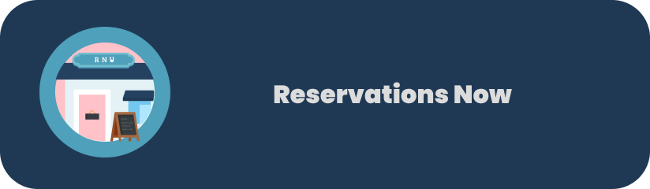

# Reservations Now
<br />
<p align="center">
<a align="center">
    
 </a>
</p>
<p align="center">
  <a>
    
  </a>

  <h3 align="center">Reservations Now</h3>

  <p align="center">
    Reservations, orders and administration, all gathered in one place.
  </p>
</p>


## TP01 - Protótipo de Sistema para Reservas em Restaurantes
Esse é um protótipo de um aplicativo móvel para que um usuário consiga fazer reservas em um restaurante de forma ágil e simples. Principalmente na atualidade, em que o distanciamento social é necessário e os restaurantes precisam diminuir o número de mesas disponíveis, o sistema de reservas se torna a melhor opção ao sair para comer. Com ele, você também pode consultar o cardápio do local previamente, acompanhar sua comanda em tempo real, e ver o histórico de reservas feitas previamente, permitindo que o usuário avalie o serviço e dê o feedback para outros interessados.

### O seu protótipo é descartável ou evolucionário? Justifique.
Evolucionário. As telas de navegação do cliente e suas rotas estão todas implementadas, e como o JavaScript é bem versátil e fácil de entender, principalmente com a tipagem permitida pelo TypeScript, qualquer mudança é bem simples de ser feita e integrada. 

### Quais as características da linguagem escolhida fazem ela apropriada para o desenvolvimento de um protótipo?
O React-Native atua como um dos principais frameworks para desenvolvimento mobile, e junto com o typescript, o código fica muito mais fácil de entender e realizar o debug. ALém disso, o grande acervo de bibliotecas abre um leque de infinitas possibilidades, sendo difícil não existir algo que ajude em um componente que queira implementar.

### Que dificuldades você teve no desenvolvimento do protótipo?
Como existem diversas bibliotecas e vários componentes, uns até bem parecidos com os outros, foi exigido um estudo longo para entender qual seria o melhor para cada situação. Também surgiram problemas quanto à diferença entre os aparelhos móveis android e iPhone, dificultando a responsividade e sendo necessário fazer algumas adaptações, a depender da plataforma.

### Quais as vantagens de ter um protótipo desenvolvido antes da implementação do programa efetivo?
O protótipo permite verificar com o cliente sua satisfação com o andamento, e também se as funcionalidades essenciais do produto funcionam antes de desenvolver o programa completo. Como é evolucionário, o desenvolvimento pode se adaptar a qualquer mudança de requisitos que o cliente faça.

### Built With

* [Expo](https://expo.io)
* [React-Native](https://reactnative.dev)
* [Yarn](https://yarnpkg.com)

### Pre-Installation
Install all the dependencies mentioned in the <a href="#built-with">Built With</a></ section

### Installation

1. Clone the repository;

2. Install all dependencies;
  ```sh
  yarn
   ```  

3. Start expo server;
  ```sh
   expo start
   ```

4. Press a on terminal to open app on andorid emulator or scan the qr code to run on physical device;

5. Use the application :smile:

